# Инструкция для экспертов
**Основная задача** сертификации - актуализировать темы, которые преподаются на ИТ-дисциплинах в харьковских университетах. Для этого выстроена система сертификации содержания ИТ-дисциплин.

## Последовательность действий.
### Оценка дисциплин
1. **Преподаватель** заполняет [форму описания дисциплины](https://docs.google.com/document/d/1aE-HZqK0xGfwAV-uBYe28oPXpIeUntL5BFlkMlOcBbU/edit), которая состоит из названия, общего описания дисциплины, описание требований к ПО и технике, необходимой для изучения дисциплины, структуры и составляющих дисциплины (теория, практика, самостоятельная работа), описанию итогового проекта, списка источников, механизмах контроля, результатов обучения. 
2. Заполненная **форма анонимизируется** и **отправляется 2-м экспертам**, которые работают в различных ИТ-компаниях.
3. Эксперты просамтривают заполненные формы, проставляют оценку и дает общии рекомендации в предусмотренных для этого местах в форме, при необходимости - делают комментарии (инструмент комментирования Google-документов).
4. Преподаватели получают рецензии.
5. При необходимости (программа оценена ниже чем 4 из 5) - преподаватели вносят изменения в программу и отправляют на рецензировани повторно (тем же экспертам).
### Внедрение
После получения положительной оценке дисциплины:
1. Преподаватель обновляет рабочую программу дисциплины на основе полученных рецензий и утверждает ее (на заседании своей кафедры)
2. Преподаватель проводит дисциплину (в рамках учебного плана).
3. Преподаватель в рамках проведения дисциплины приглашает практикующего специалиста (предпочтительно - рецензента программы дисциплины) на минимум 1 гостевую лекцию.
4. Преподаватель проводит итоговое занятие (в рамках учебного курса или вне его), на котором презентуются результаты студентов (формат согласовывается с рецензентами курса: презентация итоговых проектов, техническое собеседование, хакатон, др.). Итоговое занятие посещают рецензенты данного курса и делают итоговое заключение а качестве подготовки студентов.
5. Преподаватель предоставляет итоговые оценки и работы студентов по курсу рецензентам и малой рабочей группе (для того, чтобы можно было верифицировать результаты).
### Итоговые мероприятия
1. При условии позитивного заключения экспертов по итоговому занятию, верификации результатов студентов, успешном окончании курса 60+% студентов, 20+% на отлично - преподаватель получает сертификат и денежную премию в размере $500 из фонда проекта.

### Рекомендации экспертам.
**Общая роль эксперта** - оценить актуальность технологий, владению которыми обучают студентов.
**Важное замечание** - у курса есть ограничение по времени (1 семестр - это в среднем 16 недель по 2 пары в неделю), а у студентов есть ограничения на усвоение информации (невозможно дать материала больше, чем может качественно воспринять и усвоить студент). Например - за 1 семестр невозможно с нуля научить студента современной верстке, освоить JavaScript и выучить ReactJS и AngularJS

### Структура формы
Ниже будут приведены элементы формы с комментариями к элементам формы и частью, которые заполняет эксперт.  
#### Блок 1. Общее описание диципилины
##### Информация от преподавателя
В данном блоке преподаватель заполняет:
* **общую информацию по дисциплине:** название и шифр специальности, название образовательной программы, дисциплина и категория дисицплины, кол-во студентов и курс
* **общее описание дисциплины:** Анотация, цель дисциплины, типы занятий и контрля, объём занятий, предварительные дисциплины и наобходимые знания и умения.
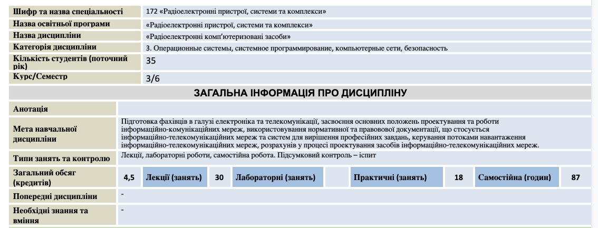  

##### Комментарии эксперта
Эксперт оценивает то, на сколько четко и понятно сформулировано общее описание дисциплины.
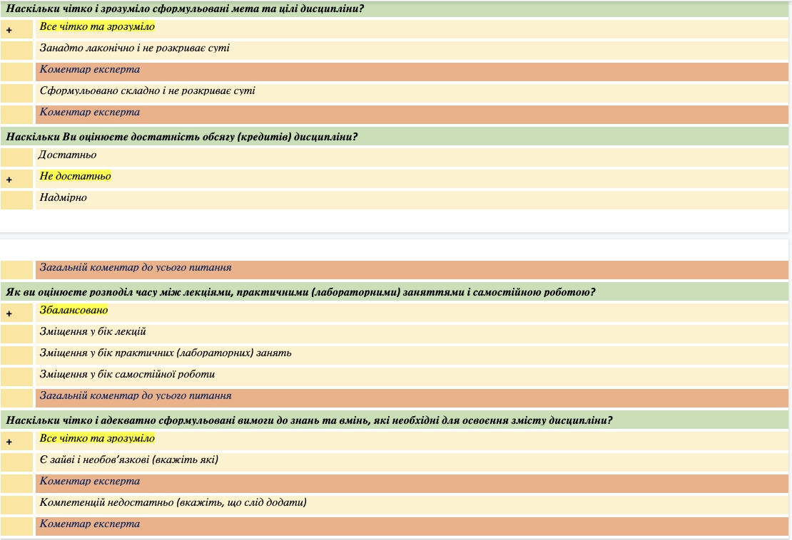   

#### Блок 2. Материально-техническое и программное обеспечение 
##### Информация от преподавателя
Что используется для проведение дисциплины  
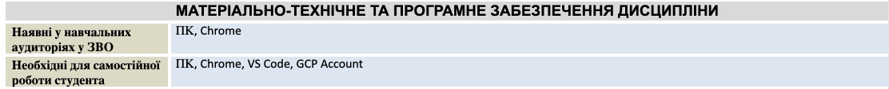  

##### Комментарии эксперта
Эксперт оценивает - является ли актуальным и достаточным обеспечпение дисциплины
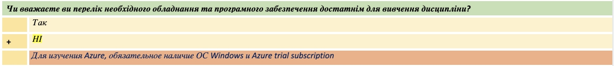  

#### Блок 3. Структура и содержание дисциплины
##### Информация от преподавателя
Основной блок от преподавателя, который отображает суть занятий, которые проводятся в рамках дисциплины (1 блок - это 1 пара, т.е. 1 час 20 минут)
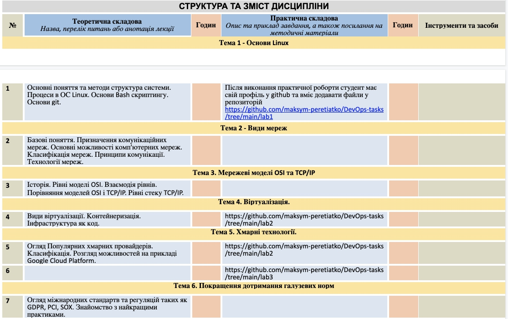   

##### Комментарии эксперта
Эксперт дает оценку того в соответствии с целями дисциплины все ли необходимые темы указаны (и перечисляет те темы, которых недостает); указывает на то являются ли технологии и знания которым планируется обучать студентов данной дисцпилины актуальными и современными, а также указывает достаточно ли практических занятий для овладения заявленными технологиями.  
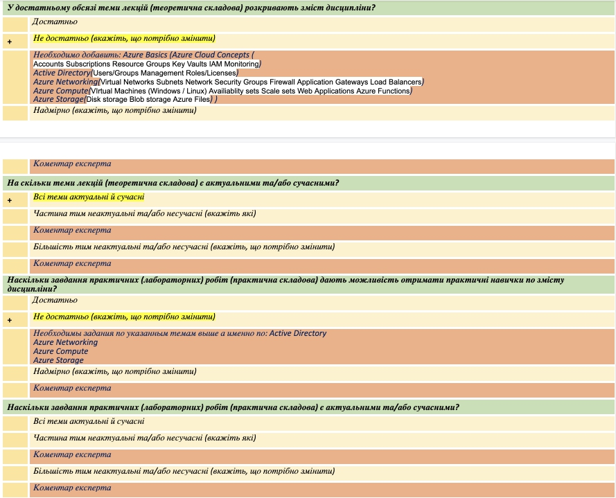  

#### Блок 4. Темы и задания для самостоятельной работы
##### Информация от преподавателя
Материалы, которые в рамках курса подразумеваеют самостоятельное изучение студентом, а также методы контроля и оценивания самостоятельной работы.
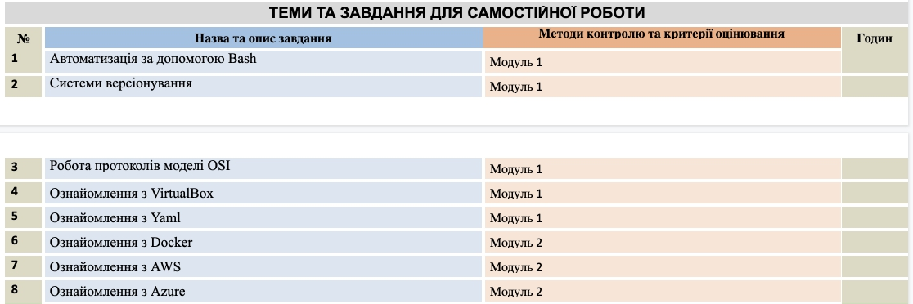  

##### Комментарии эксперта
Эксперт дает оценку достаточности и актуальности тем для самостоятельного изучения, а также методы контроля дают возможность оценить степень выполнения заданий
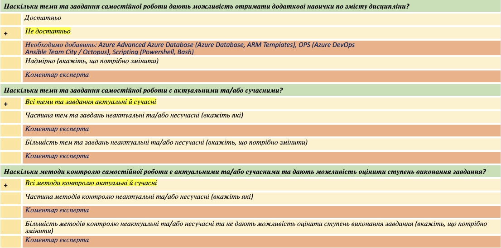  

#### Блок 5. Итоговый проект
##### Информация от преподавателя
Описание проекта как итогового задания, которое обобщает и закрепляет все знания и технологии, изученные в течении курса.
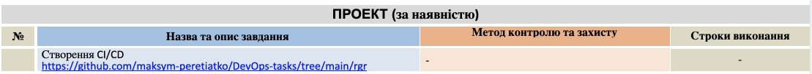  

##### Комментарии эксперта
Эксперт оценивает актуальность самого проекта, а также то, обеспечивают ли заявленные методы контроля возможность оценить степень выполнения задания
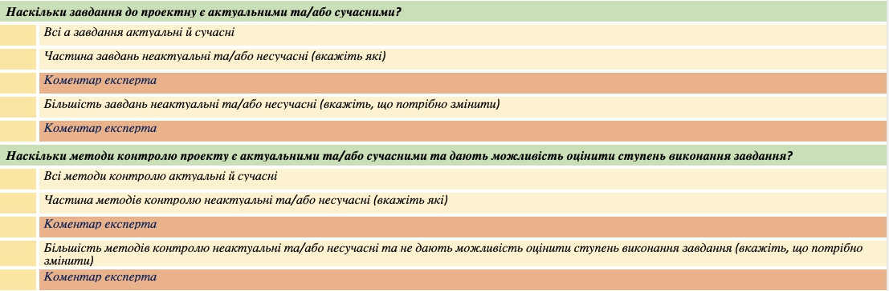  

#### Блок 6. Список источников 
##### Информация от преподавателя
Материалы, на которые преподаватель опирался при создании курса и которые предлагаются студентам для дополнительного изучения.
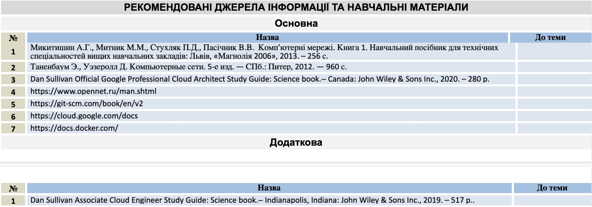  

##### Комментарии эксперта
Эксперт дает оценку является ли список источников актуальным и достаточным
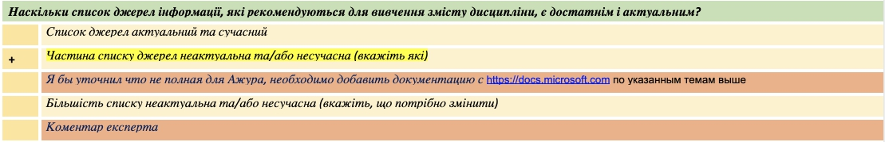  

#### Блок 7. Результаты обучения

##### Информация от преподавателя
Описание результатов обучения: какими знаниями, практическими навыками (технологиями) студенты будут владеть после успешного освоения дисциплины.
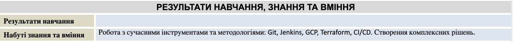  

##### Комментарии эксперта
Оценка четкости и понятности 
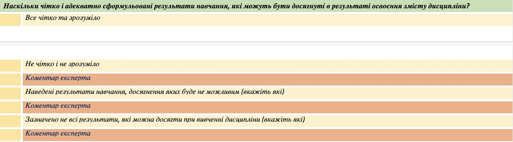  

#### Блок 8. Общие выводы
Это итогвая оценка программы. Оценки "Хорошо" и "Отлично" считаются позитивными рецензиями
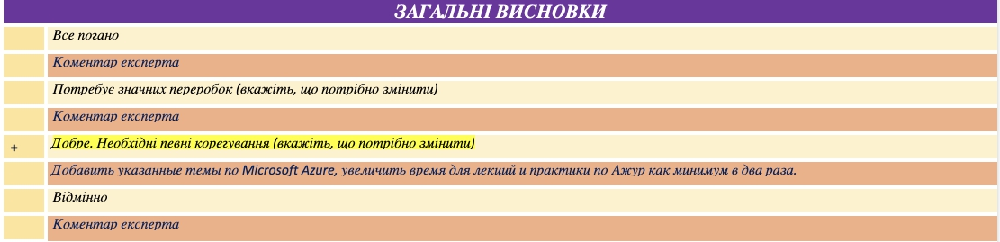  

 Для этого разработана форма, которую заполняют преподаватели, а вы, как эксперты, заполняете своими экспертными оценками.
На что необходимо обратить внимание: на все вопросы необходимо дать ответ (если вы имеете особое мнение - все равно выберите ответ, который, по вашему мнению лучше всего соответствует тому, что написано в форме, предоставленной на рецензию).  
Блок 1. Общее описание
Блок 2. Темы.
Блок 3. Литература
Блок 4. Проект.