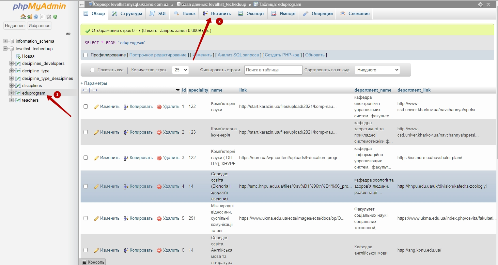
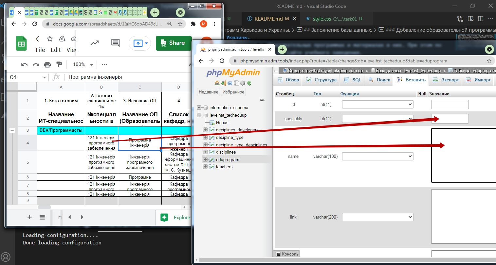
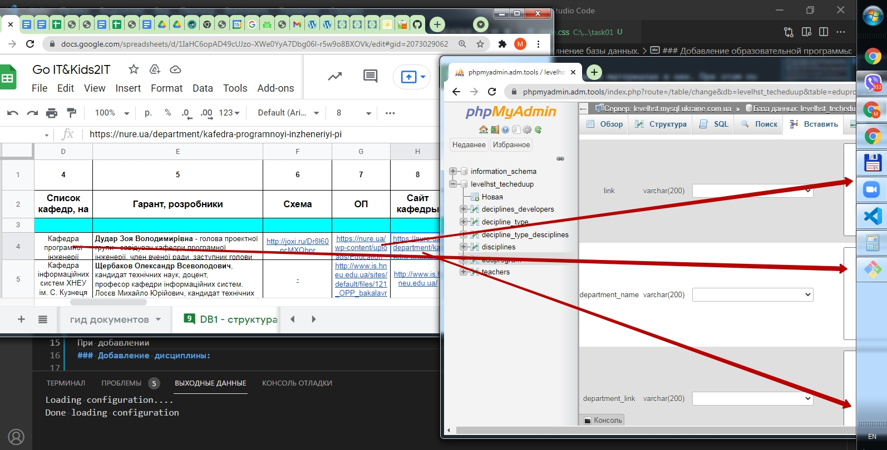
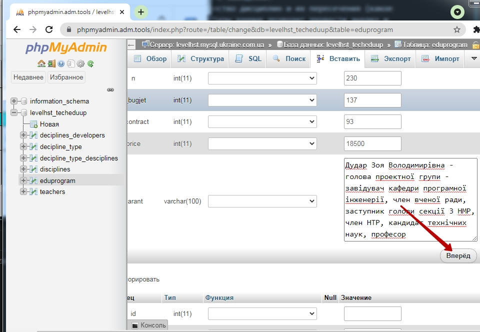
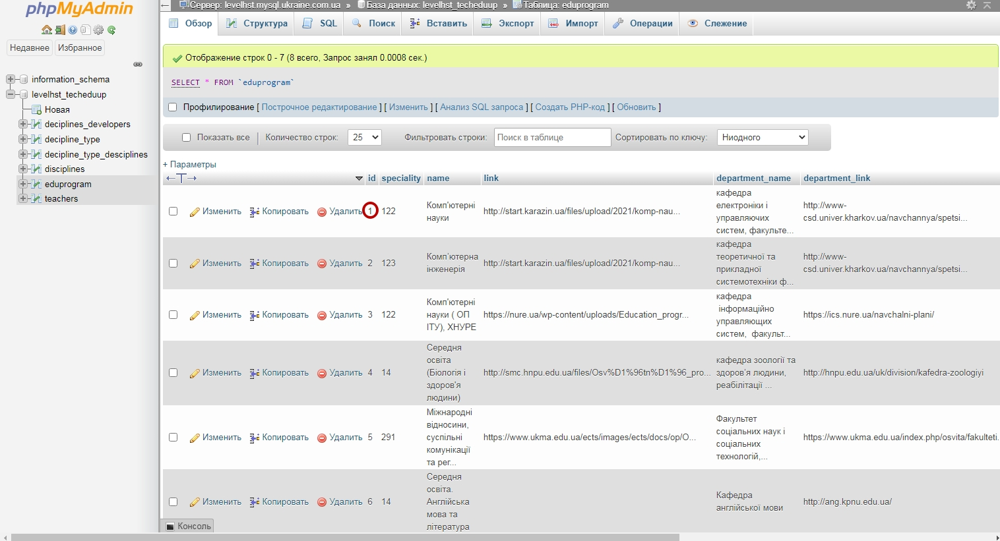
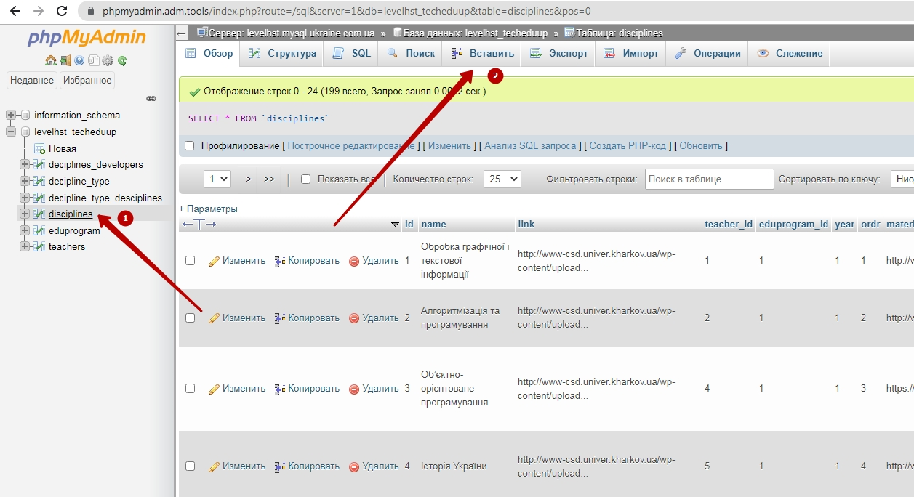
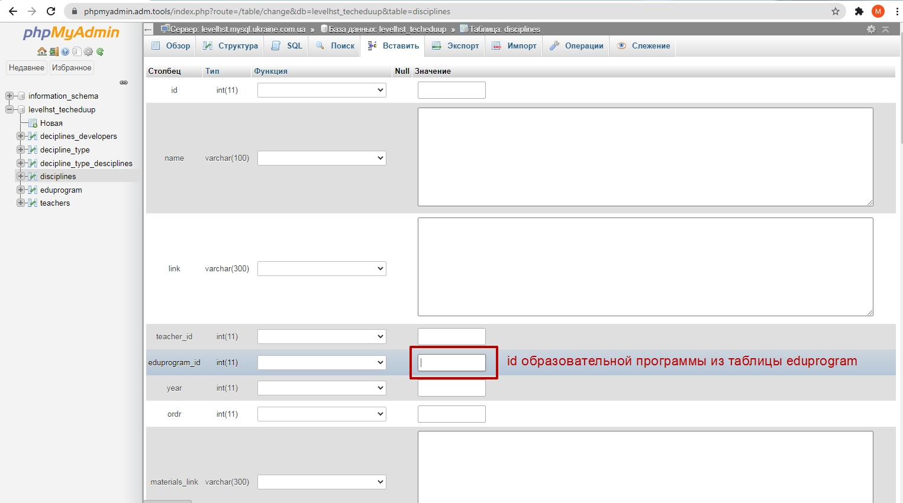

# Techeduup. База данных Образовательных программ Харькова и Украины.  
На данный момент отсутствует база данных, в которой хранится информация о образовательных программах и материалах в них. При этом по закону об образовании все рабочие программы образовательных программ доступны на сайте учебного заведения.  
На сегодня в рамках процесса сертификации образовательных программ важно понимать общее количество дисциплин и их пересечения (какое количество одинаковых дисциплин преподается на разных ОП, какое - уникальных). Наличие общей базы данных позволит провести анализ и сформировать объединения преподавателей, которые ведут одинаковые и сходные дисциплины, проводить для них мастер-классы и другие мероприятия направленные на повышение качества образования.  
## База данных.
На данный момент база данных дисциплин расположена по адресу <a href = "http://innovations.kh.ua/techeduup/">http://innovations.kh.ua/techeduup/</a>. Технически есть возможность хранить дисциплины и привязывать их к определенной образовательной программе <a href = "https://innovations.kh.ua/techeduup/disciplines.php?id=1">https://innovations.kh.ua/techeduup/disciplines.php?id=1</a>
## Заполнение базы данных.

Для заполнения базы данных используется <a href = "https://phpmyadmin.adm.tools/signon.php?user=levelhst_techeduup&password=7%2A%3BvmZ59cU&account=levelhst">интерфейс PhpMyAdmin</a> (по ссылке происходит логин).  

### Добавление образовательной программы:
Для создания информации об образовательной программе необходимо выбрать таблицу `eduprogram` и внести в нее данные о программе.  
Список [харьковских образовательных программ в ИТ.](https://docs.google.com/spreadsheets/d/1IaHC6opAD49cUJzo-XWe0YyA7Dbg06l-r5w9o8BXOVk/edit#gid=2073029062) лист: **DB1 - структура работы с кафедрами и самоуправлени** (доступ для почт в домене ИТ-кластера и по запросу).

При добавлении
### Добавление Образовательной программы:
Создаем новую запись в таблице `eduprogram`:  

переносим данные из таблицы  
  
  

После внесения данных нажимаем кнопку **"Вперед"**
  
Запоминте ID.  

### Добавление дисциплины:

